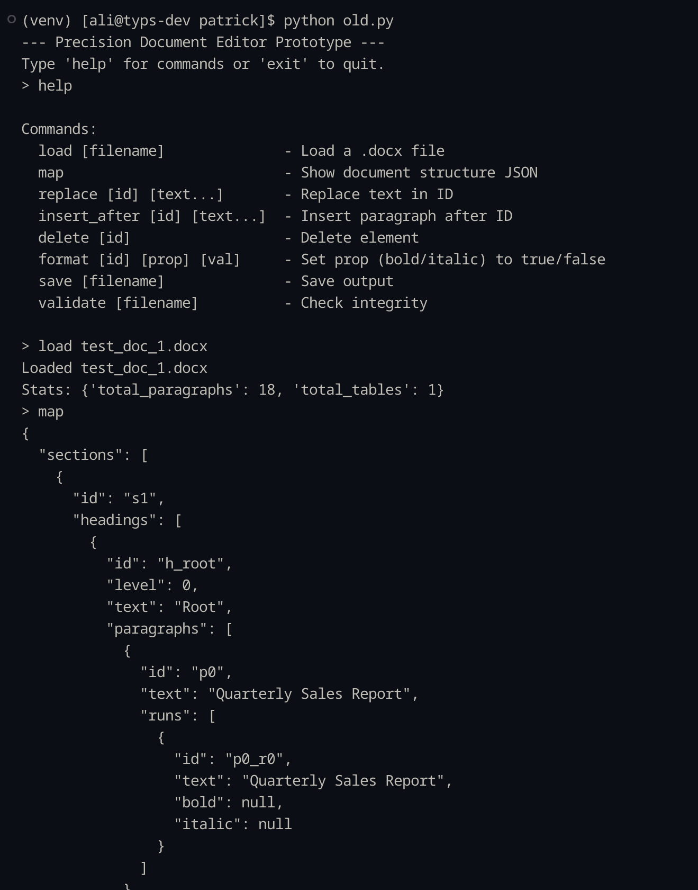
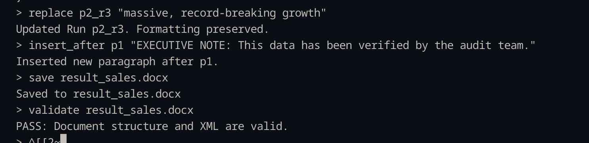
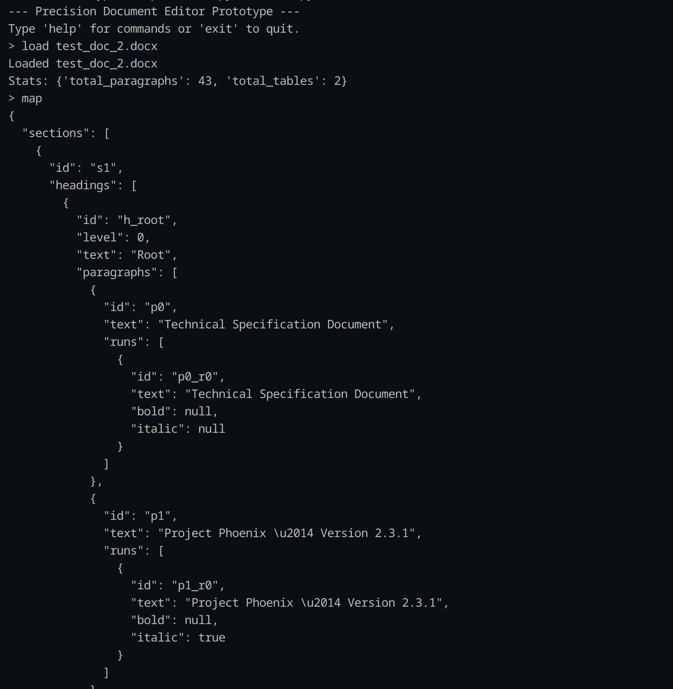
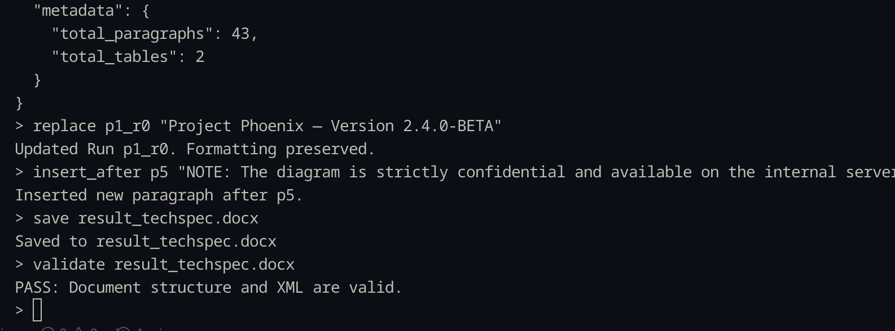

# CLI based Doc Manipulation

This is my submission for the Doc Manipulation challenge. It's a command-line tool that parses `.docx` files, maps them to JSON, and allows for surgical edits (replace, insert, delete, format) while keeping the underlying XML valid.

## Quick Start

### 1. Setup
I used `python-docx` to handle the file structure, but I had to "break out" of the library standard features to handle the XML injection.

```bash
# Install dependencies
pip install python-docx lxml
```

### 2. Run the editor
python main.py
```

### 3. Example Workflow
Once you are inside the CLI (`>`), try this sequence:

```text
> load test_doc.docx
> map                       <-- See the structure
> replace p1_r1 "EDITED"    <-- Surgical edit on a Run
> insert_after p3 "New P"   <-- The hard part (XML insertion)
> save output.docx
> validate output.docx      <-- Checks integrity
```

---

## Design Decisions & Approach

**Why `python-docx`?**
Given the 4-hour time limit, writing a raw `.docx` (Zip/XML) parser from scratch seemed like a bad use of time. I used the library to handle the boilerplate (opening/saving), which allowed me to focus on the logic for **OXML manipulation**.


---

## The Problem: `INSERT_AFTER`

The standard library only lets you append paragraphs to the bottom of the document (`doc.add_paragraph`). It doesn't natively support "inserting" in the middle.

**The Fix:**
I had to access the underlying XML element (`._element`) of the target paragraph, get its parent, and manually insert the new node into the XML tree at the correct index.

```python
# From my code:
parent.insert(parent.index(target_xml) + 1, new_p_xml)
```

This ensures the document structure stays valid while placing content exactly where the user wants it.

---

## Limitations (What I'd do with more time)

1.  **Table Parsing:** Right now, I'm just counting tables. Navigating inside cells (rows/columns) requires a recursive map function that I didn't have time to polish.
2.  **Safety Checks:** The tool assumes the user inputs valid IDs. I'd add better error handling for typos.
3.  **Styles:** Currently, `INSERT_AFTER` tries to copy the style of the previous paragraph, but complex nested styles might get simplified.

---

## Validation
I included a `validate` command that actually attempts to unzip the output file and parse the internal `document.xml` using `lxml`. If the tags are malformed, it throws an error. This catches corruption before you try to open it in Word.

---

## Screenshots

### Doc 1




### Doc 2



